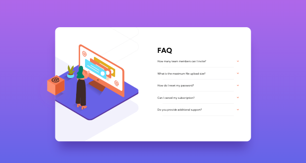

# frontend-project-faq-accordion-card
 A FAQs card showcasing accordion functionality built with HTML, CSS, and JS.

## Table of contents

- [Overview](#overview)
  - [The challenge](#the-challenge)
  - [Screenshot](#screenshot)
  - [Links](#links)
- [My process](#my-process)
  - [Built with](#built-with)
- [Author](#author)

## Overview

### The challenge

Users should be able to:

- View the optimal layout for mobile and desktop view
- See hover states for all interactive elements on the page
- Hide/Show the answer to a question when the question is clicked

### Screenshot

 

### Links

- Solution URL: [https://github.com/judgemongcal/frontend-project-faq-accordion-card]
- Live Site URL: [https://sage-lily-8f4ce4.netlify.app/]

## My process

My process started with coding all the HTML elements necessary for this project one by one, and styling them with CSS to allow myself to focus on completing one area of the design before I move on with the next one (divide and conquer approach). This structure is also applied in writing CSS, to allow for other people to easily navigate the code. After the HTML and CSS is set, I then proceeded with adding the accordion functionality via JS. 

### Built with

- Semantic HTML5 markup
- CSS custom properties
- Flexbox
- Mobile-first workflow
- Responsive Design
- Vanilla JS

## Author

- LinkedIn - [@judgemongcal](https://www.linkedin.com/in/judgemongcal/)
- Frontend Mentor - [@judgemongcal](https://www.frontendmentor.io/profile/judgemongcal)